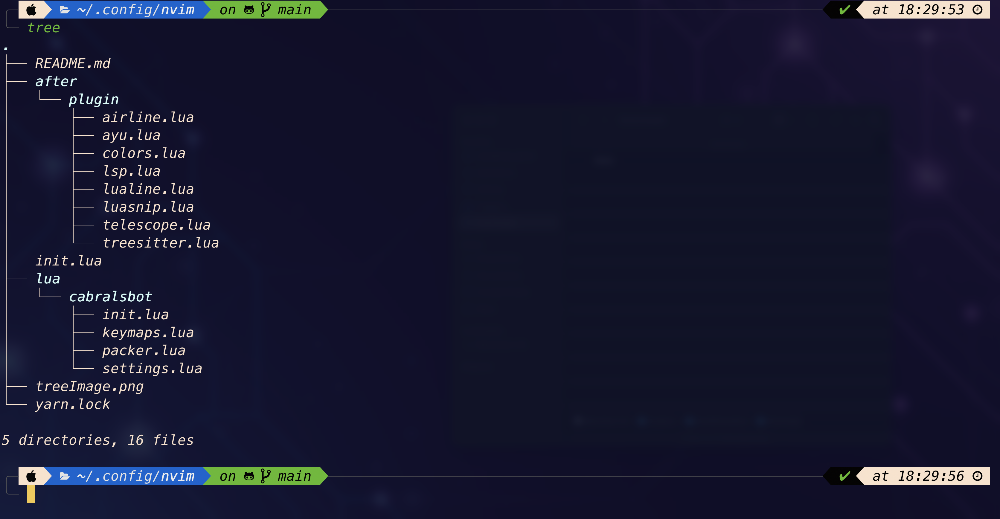

# nvim

## Configuring your setup for #Neovim MINIMALIST

Here I installed:

-   a package manager (Packer)
-   Installation of Themes and file manager (Telescope)
-   Telescope Configuration
-   Theme Configuration
-   Treesitter Installation
-   Treesitter Configuration
-   lsp-zero Installation
-   ls-zero Configuration

-   useful key combination for nvim

